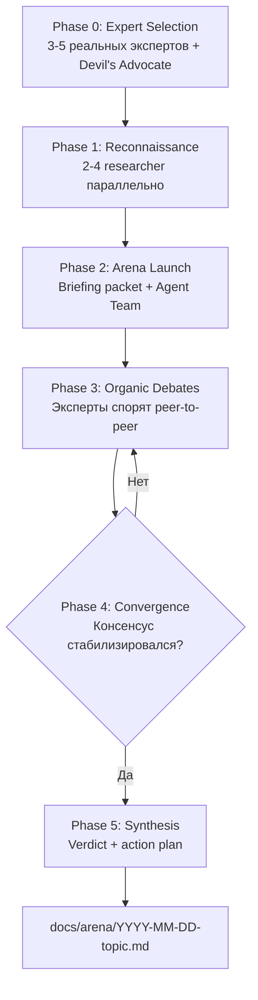

<p align="right"><a href="./README.md">English</a> | <strong>Русский</strong></p>

# Arena

Сравнивайте экспертные точки зрения и приходите к чёткому решению.

## Prerequisites

> **Agent Teams экспериментальны и по умолчанию выключены.** Перед использованием плагина их нужно включить.

Добавьте `CLAUDE_CODE_EXPERIMENTAL_AGENT_TEAMS` в `settings.json` или окружение:

```json
// ~/.claude/settings.json
{
  "env": {
    "CLAUDE_CODE_EXPERIMENTAL_AGENT_TEAMS": "1"
  }
}
```

Или задайте переменную окружения:

```bash
export CLAUDE_CODE_EXPERIMENTAL_AGENT_TEAMS=1
```

После включения перезапустите Claude Code.

## Installation

```bash
/plugin marketplace add izzzzzi/izTeam
/plugin install arena@izteam
```

## Usage

```
/arena <question>
```

**Examples:**
```
/arena Should we use microservices or monolith for our SaaS?
/arena What's the best pricing strategy for a developer tool?
/arena How should we handle state management in our React app?
```

Подходит для любых доменов: engineering, product, strategy, business, science, philosophy.

## How It Works



Во время дебатов: эксперты дают позицию с self-critique, оспаривают аргументы друг друга, меняют позицию при убедительных доводах. Devil's Advocate может наложить veto на критические изъяны. Модератор даёт live commentary по ключевым моментам.

## Structure

```
arena/
├── .claude-plugin/
│   └── plugin.json
├── skills/
│   └── arena/SKILL.md
├── agents/
│   ├── expert.md
│   └── researcher.md
├── README.md
└── README.ru.md
```

## Key Design Principles

| Principle | Why |
|-----------|-----|
| **Real people** | Эксперты основаны на реальных публичных позициях |
| **Intentional conflict** | Противоположные мнения вскрывают скрытые допущения |
| **Direct communication** | Эксперты спорят peer-to-peer |
| **Position change = strength** | Сильные аргументы могут менять позицию |
| **Devil's Advocate with veto** | Защита от groupthink |
| **Live commentary** | Вы видите эволюцию рассуждений в реальном времени |

## When to Use

- Архитектурные или стратегические решения с высокой ставкой
- Trade-offs без очевидного правильного ответа
- Ситуации, где нужны разные экспертные взгляды
- Stress-test идей перед фиксацией решения
- Вопросы, где обоснованные эксперты могут не согласиться

## License

MIT
