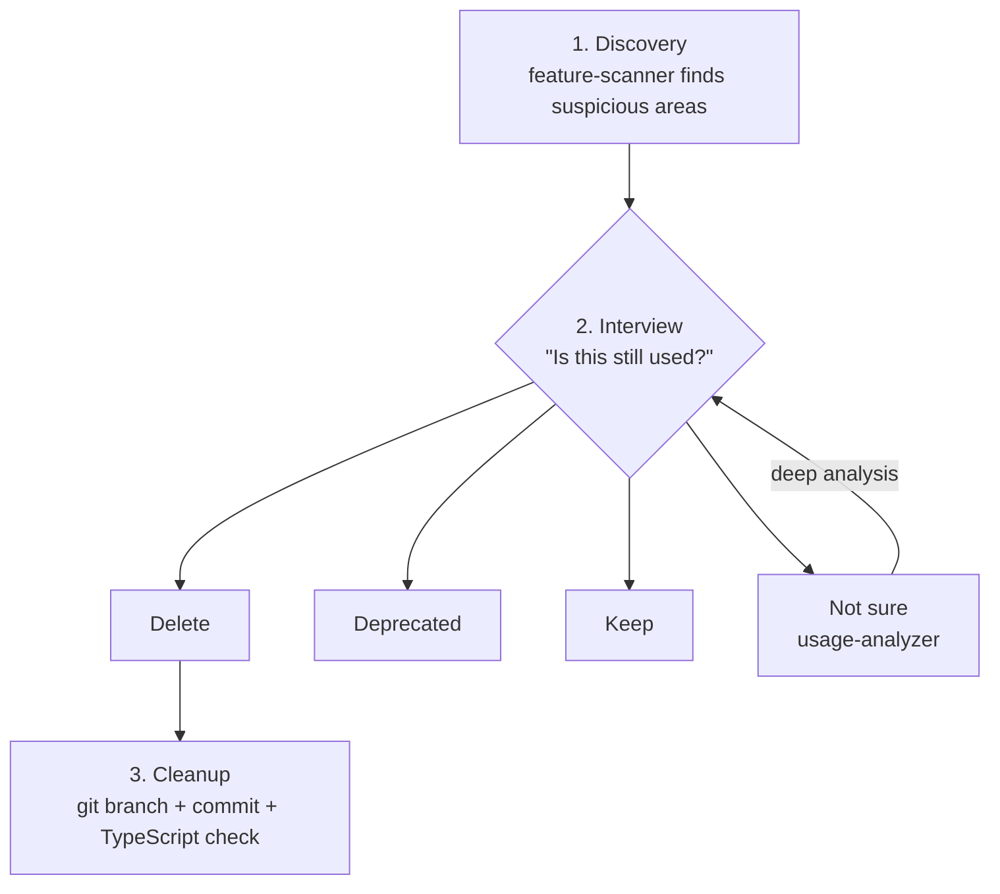

<p align="right"><strong>English</strong> | <a href="./README.ru.md">Русский</a></p>

# Audit

Find dead and outdated code with an interactive audit.

## Problem

In fast iteration projects, experimental code tends to accumulate:
- A feature was tried and abandoned
- Refactoring left old paths behind
- Temporary variants stayed in production code

Static analysis often misses this, because code can still be referenced while no longer needed by the product.

## Solution

**Interactive audit:**
1. Agent finds suspicious areas
2. Asks whether each area is still needed
3. Removes confirmed dead code safely with git backup

## Installation

```bash
/plugin marketplace add izzzzzi/izTeam
/plugin install audit@izteam
```

## Usage

```
/audit              # Full codebase scan (feature-scanner)
/audit features     # src/features/ deep audit (features-auditor)
/audit server       # src/server/ routers & services (server-auditor)
/audit ui           # src/design-system/ components (ui-auditor)
/audit stores       # src/stores/ Zustand state (stores-auditor)
```

## Workflow



## Agents

### Core Agents

| Agent | Purpose |
|-------|---------|
| `feature-scanner` | Full scan: features, routers, pages |
| `usage-analyzer` | Deep analysis of a specific feature |
| `cleanup-executor` | Safe removal with git backup |

### Specialized Auditors

| Agent | Target | What it finds |
|-------|--------|---------------|
| `ui-auditor` | `src/design-system/` | Unused components, style inconsistencies |
| `stores-auditor` | `src/stores/` | Dead Zustand slices, unused selectors |
| `features-auditor` | `src/features/` | Unused exports, internal dead code |
| `server-auditor` | `src/server/` | Unused tRPC procedures, dead services |

## Safety

- Never deletes without confirmation
- Creates git branch before deletion
- Checks TypeScript after deletion
- Logs all changes

## License

MIT
