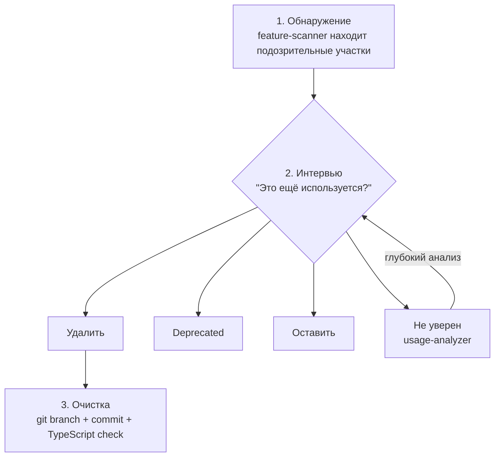

<p align="right"><a href="./README.md">English</a> | <strong>Русский</strong></p>

# Audit

Находите мёртвый и устаревший код через интерактивный аудит.

## Проблема

В проектах с быстрой итерацией экспериментальный код накапливается:
- Фичу попробовали и забросили
- После рефакторинга остались старые пути
- Временные варианты остались в production-коде

Статический анализ часто это пропускает: код может быть формально использован, но уже не нужен продукту.

## Решение

**Интерактивный аудит:**
1. Агент находит подозрительные участки
2. Уточняет, нужен ли каждый участок
3. Безопасно удаляет подтверждённый dead code с git backup

## Установка

```bash
/plugin marketplace add izzzzzi/izTeam
/plugin install audit@izteam
```

## Использование

```
/audit              # Полный скан кодовой базы (feature-scanner)
/audit features     # Глубокий аудит src/features/ (features-auditor)
/audit server       # Роутеры и сервисы src/server/ (server-auditor)
/audit ui           # Компоненты src/design-system/ (ui-auditor)
/audit stores       # Zustand-состояние src/stores/ (stores-auditor)
```

## Рабочий процесс



## Агенты

### Основные агенты

| Агент | Назначение |
|-------|------------|
| `feature-scanner` | Полный скан: features, routers, pages |
| `usage-analyzer` | Глубокий анализ конкретной фичи |
| `cleanup-executor` | Безопасное удаление с git backup |

### Специализированные аудиторы

| Агент | Цель | Что находит |
|-------|------|-------------|
| `ui-auditor` | `src/design-system/` | Неиспользуемые компоненты, style inconsistencies |
| `stores-auditor` | `src/stores/` | Мёртвые Zustand slices, неиспользуемые selectors |
| `features-auditor` | `src/features/` | Неиспользуемые exports, внутренний dead code |
| `server-auditor` | `src/server/` | Неиспользуемые tRPC procedures, мёртвые services |

## Безопасность

- Никогда не удаляет без подтверждения
- Создаёт git branch перед удалением
- Проверяет TypeScript после удаления
- Логирует все изменения

## Лицензия

MIT
