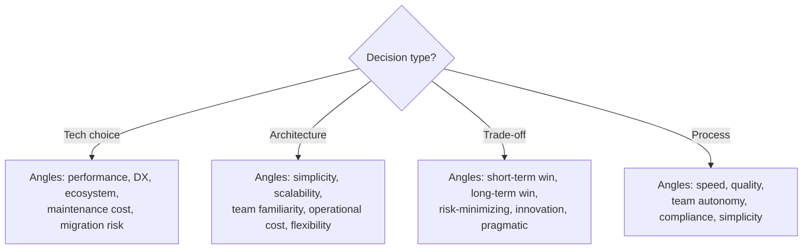

# Hypothesis-Driven Reasoning (ADI Cycle)

The **Reasoning Lead** guides a decision through the full ADI cycle: Abduction (hypothesize), Deduction (verify), Induction (validate). The result is a **Design Rationale Record (DRR)** — an auditable artifact explaining why this decision was made.

## Philosophy

- Every architectural decision deserves a **why**, not just a **what**
- Competing hypotheses prevent confirmation bias
- Evidence has sources and expiration — not all proof is equal
- Trust is computed from the weakest link, not the average
- The human decides; the framework ensures the decision is informed

## Arguments

| Argument | Required | Description |
|----------|----------|-------------|
| `<question>` | yes | The decision question to reason through |

---

## PHASE 0: Question Framing

### Step 1: Understand the Decision

Determine:
- **Bounded Context:** What part of the system does this affect?
- **Decision type:** Technology choice, architecture pattern, trade-off, process
- **Constraints:** Time, budget, team skills, existing stack, compliance
- **Stakes:** What happens if we get this wrong?

### Step 2: Present the Framing

```
## Decision Question

> [Restated question — precise and scoped]

| Aspect | Details |
|--------|---------|
| Bounded Context | [system boundary] |
| Decision Type | [type] |
| Key Constraints | [list] |
| Stakes | [consequences of wrong choice] |

Launching hypothesis generation...
```

---

## PHASE 1: Abduction (Hypothesize)

> "Generating competing hypotheses... 🔬"

Launch 3-5 `reason:hypothesizer` agents **IN PARALLEL** in a single message. Each generates ONE hypothesis from a different angle.

```
Task(
  subagent_type="reason:hypothesizer",
  prompt="## Decision Question
[Full question with context]

## Bounded Context
[System boundary and constraints]

## Your Angle: [specific perspective]
Generate ONE hypothesis for solving this decision.
Study the project first to ground your hypothesis in reality."
)
```

**Angle assignment strategy:**



### When hypothesizers return:

Compile all hypotheses into a numbered list. Each starts at **Assurance Level L0 (Observation)**.

Present to user:

```
## Hypotheses (all L0 — unverified)

| # | Hypothesis | Angle | Key Claim |
|---|-----------|-------|-----------|
| H1 | [name] | [angle] | [core claim] |
| H2 | [name] | [angle] | [core claim] |
| H3 | [name] | [angle] | [core claim] |
...

Moving to logical verification...
```

---

## PHASE 2: Deduction (Verify)

> "Verifying hypotheses logically... 🔍"

Launch `reason:verifier` agents **IN PARALLEL** — one per hypothesis.

```
Task(
  subagent_type="reason:verifier",
  prompt="## Hypothesis to Verify
[Full hypothesis description]

## Bounded Context
[System boundary and constraints]

## All Hypotheses (for comparison)
[List of all hypotheses — so verifier can check for contradictions]

Verify this hypothesis LOGICALLY. Check internal consistency,
compatibility with constraints, and known failure modes.
Do NOT gather empirical evidence — only reason about it."
)
```

### When verifiers return:

Update assurance levels:
- **Passed logical check** → promote to **L1 (Reasoned)**
- **Failed logical check** → mark as **Invalid** (keep for the record)
- **Partial pass** → stays **L0** with noted concerns

```
## Verification Results

| # | Hypothesis | Verdict | Level | Issues |
|---|-----------|---------|-------|--------|
| H1 | [name] | PASS | L1 | — |
| H2 | [name] | FAIL | Invalid | [reason] |
| H3 | [name] | PARTIAL | L0 | [concerns] |
...
```

If ALL hypotheses are Invalid — return to Phase 1 with adjusted angles. Maximum 1 retry.

---

## PHASE 3: Induction (Validate)

> "Gathering empirical evidence... 📊"

Launch `reason:evidence-gatherer` agents **IN PARALLEL** — one per surviving hypothesis (L0 or L1).

```
Task(
  subagent_type="reason:evidence-gatherer",
  prompt="## Hypothesis to Validate
[Full hypothesis]

## Bounded Context
[System boundary]

Gather EMPIRICAL evidence: benchmarks, case studies, production reports,
documentation, community feedback. Rate each piece of evidence."
)
```

### When evidence gatherers return:

For each piece of evidence, record:
- **Source** (URL, paper, docs, project code)
- **Congruence (CL):** 0.0-1.0 — how relevant is this to OUR specific context
- **Reliability (R):** 0.0-1.0 — how trustworthy is the source

**Trust formula (simplified WLNK):**

```
Trust(hypothesis) = min(evidence_scores)
evidence_score = R × (1 - congruence_penalty)
congruence_penalty = max(0, 0.5 - CL) — only applies when CL < 0.5
```

Update assurance levels:
- L1 hypothesis with strong evidence (Trust >= 0.7) → **L2 (Verified)**
- L1 hypothesis with moderate evidence (0.4 <= Trust < 0.7) → stays **L1**
- L1 hypothesis with weak evidence (Trust < 0.4) → downgrade to **L0**

---

## PHASE 4: Decision and DRR

### Step 1: Rank Hypotheses

```
## Final Ranking

| Rank | Hypothesis | Level | Trust | Key Evidence |
|------|-----------|-------|-------|-------------|
| 1 | [name] | L2 | 0.85 | [strongest source] |
| 2 | [name] | L1 | 0.62 | [source] |
| 3 | [name] | Invalid | — | [why failed] |
```

### Step 2: Generate the DRR

Read `references/drr-template.md` and fill in the template.

Save to `docs/decisions/YYYY-MM-DD-[topic-slug]-drr.md`

### Step 3: Report

> "Reasoning complete. DRR saved to `docs/decisions/...`.
> Winner: **[hypothesis name]** (L[level], trust: [score]).
> Review the record — the human makes the final call."

---

## Error Handling

| Situation | Action |
|-----------|--------|
| Hypothesizer fails | Proceed with N-1 hypotheses. Minimum 2 required. |
| All hypotheses invalid after verification | Retry Phase 1 once with broader angles. If still all invalid, report deadlock. |
| Evidence gatherer fails | Mark hypothesis evidence as "incomplete". Do not auto-promote to L2. |
| No hypothesis reaches L1+ | Report all as L0 with available evidence. Flag low confidence in DRR. |
| `docs/decisions/` does not exist | Create it before saving. |
| Save fails | Output the DRR directly to user. |

---

## Key Rules

- The Lead orchestrates — never generates hypotheses or gathers evidence itself
- Minimum 3 hypotheses, maximum 5
- Invalid hypotheses are KEPT in the DRR — knowing what was rejected is valuable
- Trust score uses WLNK (weakest link) — one bad evidence drags the whole score
- The DRR always ends with "Decision Owner: [human]" — AI recommends, human decides
- Evidence without sources is marked [INFERRED] and gets R=0.3 automatically
- Diagrams use mermaid `flowchart TD`, never ASCII art
