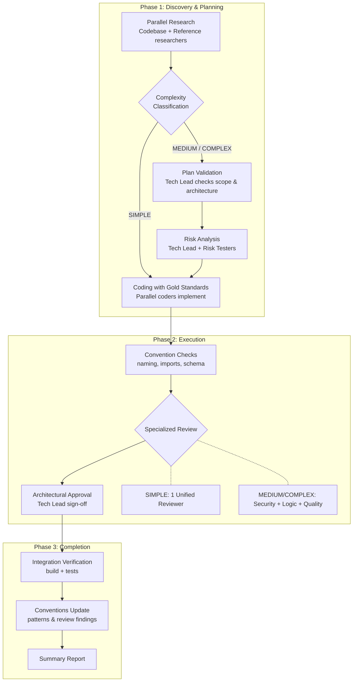

<p align="right"><a href="./README.md">English</a> | <strong>Русский</strong></p>

# Team

Реализуйте фичи с командой AI-агентов и встроенными review-gates.

## Prerequisites

> **Agent Teams экспериментальны и по умолчанию выключены.** Перед использованием плагина их нужно включить.

Добавьте `CLAUDE_CODE_EXPERIMENTAL_AGENT_TEAMS` в `settings.json` или окружение:

```json
// ~/.claude/settings.json
{
  "env": {
    "CLAUDE_CODE_EXPERIMENTAL_AGENT_TEAMS": "1"
  }
}
```

Или задайте переменную окружения:

```bash
export CLAUDE_CODE_EXPERIMENTAL_AGENT_TEAMS=1
```

После включения перезапустите Claude Code.

## Installation

```bash
/plugin marketplace add izzzzzi/izTeam
/plugin install team@izteam
```

## Usage

```
/build <description or path/to/plan.md> [--coders=N]
/brief <description> — interview first, then build
/conventions [path/to/project]
```

**Examples:**
```
/build "Add user settings page with profile editing"
/build docs/plan.md --coders=2
/brief "Add notifications"
/conventions
```

## How It Works

### /build

Team Lead оркестрирует полный поток реализации. Пайплайн масштабируется по сложности задачи: простые задачи проходят быстрее, сложные получают больше проверок.



| Level | When | What changes |
|-------|------|-------------|
| **SIMPLE** | 1 layer, no behavior changes, <3 tasks | Lightweight team, single reviewer |
| **MEDIUM** | 2+ layers, modifies existing code, 3+ tasks | Full team, specialized reviewers, risk analysis |
| **COMPLEX** | 3+ layers, touches auth/payments, 5+ tasks | Full team + deep analysis and risk testing |

---

### /conventions

Анализирует кодовую базу и создаёт/обновляет `.conventions/`:
- `gold-standards/` — короткие эталонные snippets
- `anti-patterns/` — чего избегать
- `checks/` — правила именования и импортов

`/build` использует эти conventions как reference examples. Также можно запускать `/conventions` отдельно.

## Complexity Levels

| Level | Team Size | Reviewers | Risk Analysis | Tech Lead Validation |
|-------|-----------|-----------|---------------|---------------------|
| **SIMPLE** | 4 agents | 1 unified | Skipped | Skipped |
| **MEDIUM** | 5-7 agents | 3 specialized | Yes | Yes |
| **COMPLEX** | 6-9+ agents | 3 specialized + deep analysis | Full + risk testers | Yes + user informed on key decisions |

## Team Roles

| Role | Lifetime | Purpose |
|------|----------|---------|
| **Lead** | Whole session | Оркестрирует delivery и работу команды |
| **Supervisor** | Permanent | Мониторит liveness, loops и escalations |
| **Codebase Researcher** | One-shot | Делает выжимку по структуре и конвенциям |
| **Reference Researcher** | One-shot | Даёт качественные reference files |
| **Tech Lead** | Permanent | Валидирует планы и архитектуру |
| **Coder** | Per task | Реализует задачу и делает self-checks |
| **Security Reviewer** | Permanent | Ищет exploitable vulnerabilities |
| **Logic Reviewer** | Permanent | Ищет ошибки корректности и edge-cases |
| **Quality Reviewer** | Permanent | Улучшает maintainability и consistency |
| **Unified Reviewer** | Permanent | Универсальный reviewer для SIMPLE |
| **Risk Tester** | One-shot | Проверяет явные риски целевыми проверками |

## Structure

```
team/
├── .claude-plugin/
│   └── plugin.json
├── skills/
│   ├── build/SKILL.md
│   ├── conventions/SKILL.md
│   └── brief/
│       ├── SKILL.md
│       └── references/interview-principles.md
├── agents/
│   ├── supervisor.md
│   ├── codebase-researcher.md
│   ├── reference-researcher.md
│   ├── tech-lead.md
│   ├── coder.md
│   ├── security-reviewer.md
│   ├── logic-reviewer.md
│   ├── quality-reviewer.md
│   ├── unified-reviewer.md
│   └── risk-tester.md
├── references/
│   ├── gold-standard-template.md
│   └── risk-testing-example.md
├── README.md
└── README.ru.md
```

## License

MIT
