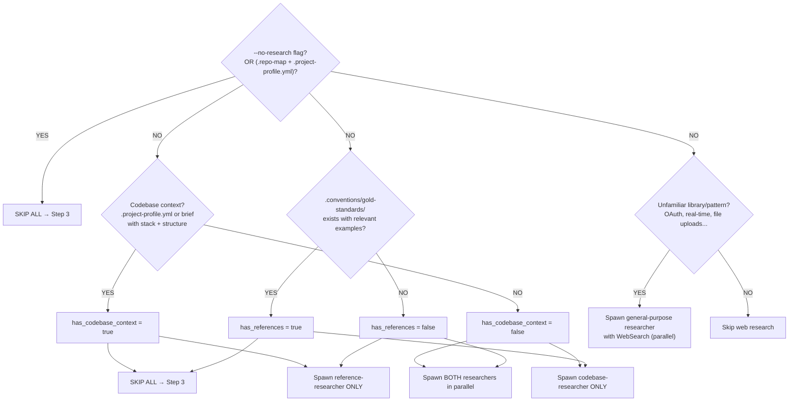
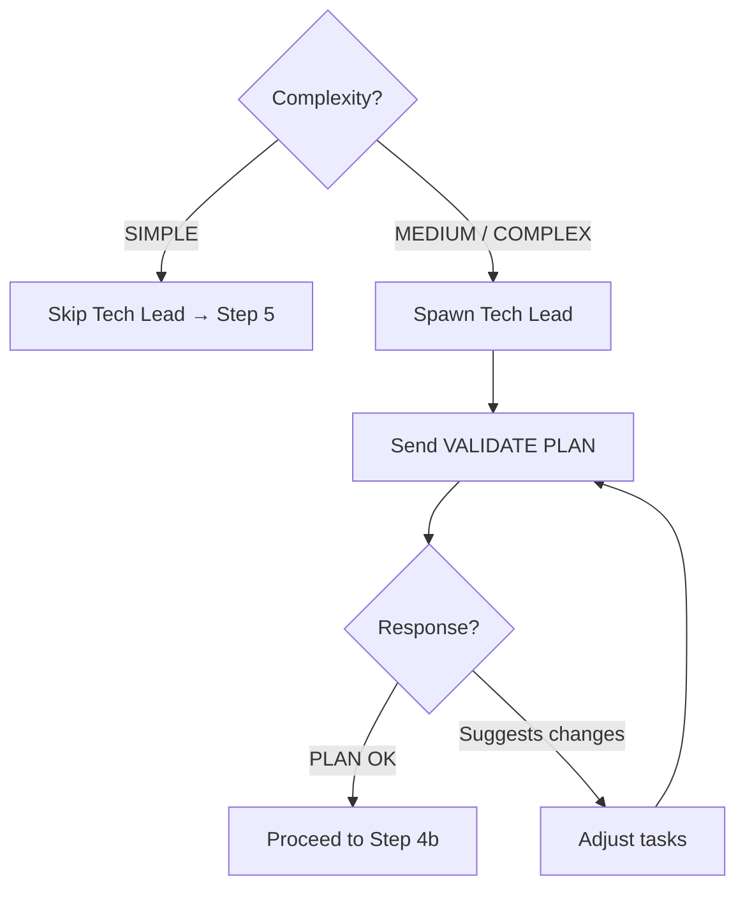
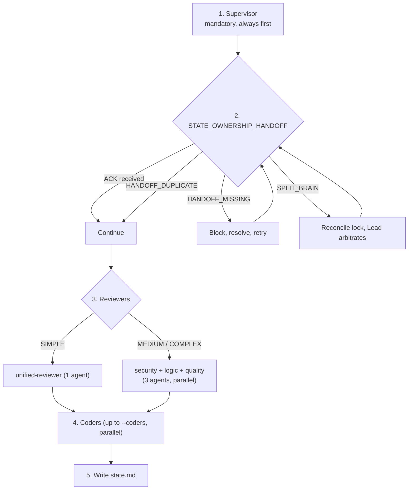
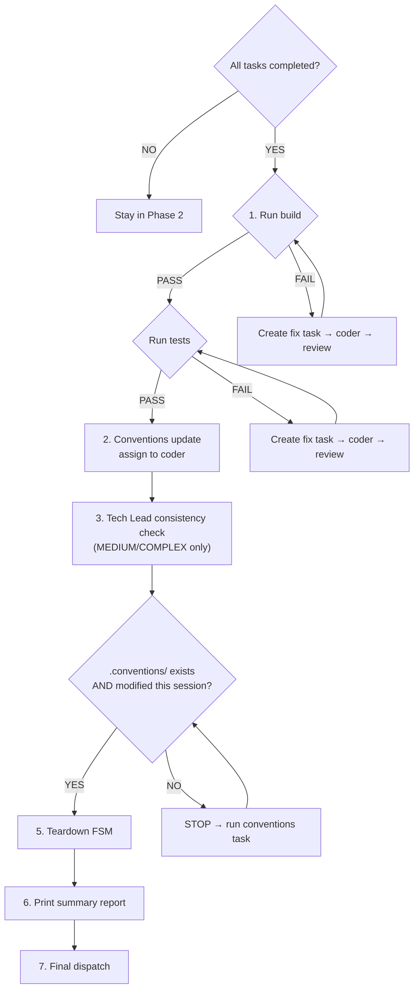

# Team Feature — Implementation Pipeline with Review Gates

The Lead is a **Team Lead** orchestrating a feature implementation. The Lead coordinates researchers, coders, specialized reviewers, and a tech lead to deliver quality code through a structured pipeline.

## Philosophy: Full Autonomy

**The Lead makes ALL decisions autonomously.** The user gives the Lead a task — possibly vague, possibly one sentence — and the Lead figures out everything else. The Lead NEVER goes back to the user to ask clarifying questions. Instead:

- **Ambiguous requirement?** → Dispatch researchers to explore the codebase, then decide.
- **Multiple valid approaches?** → Dispatch researcher for best practices, pick the most consistent.
- **Unsure about scope?** → Start with minimal viable implementation.
- **Missing context?** → Researchers find it. Do not fill Lead context with raw file contents.

**Lead context is precious.** Dispatch researchers and receive condensed summaries. Exception: `.conventions/` gold standards are short — Lead reads them directly.

## Arguments

- **String**: Feature description — the Lead decomposes it into tasks
- **File path** (`.md`): Read the plan file and create tasks from it
- **`--coders=N`**: Max parallel coders (default: 3)
- **`--no-research`**: Skip all research. Use when context is already in the prompt or brief. Also works when `.repo-map` + `.project-profile.yml` both exist (structural + semantic context available).
- **`--fresh`**: Force regeneration of `.repo-map` even if it's fresh (< 24h, no new commits).
- **`--git-checkpoints`**: Enable WIP checkpoint commits during coder workflow (see Git Mode below).

## Conventions System

`.conventions/` is the **single source of truth** for project patterns (`gold-standards/`, `anti-patterns/`, `checks/`, `tool-chains/`, `decisions/`).

- **If exists:** Read gold-standards at Step 1. Include in coder prompts as few-shot examples.
- **If not:** Researchers identify patterns. After the feature, propose creating `.conventions/`.

## Roles

| Role | Lifetime | Responsibility |
|------|----------|----------------|
| **Lead** | Whole session | Dispatch researchers, plan, spawn team, decisions, staffing |
| **Supervisor** | Whole session | Operational monitoring, liveness/loop/dedup, state.md, teardown |
| **Researcher** | One-shot | Explore codebase or web, return findings |
| **Tech Lead** | Whole session | Validate plan, architectural review, DECISIONS.md |
| **Coder** | Session-scoped | Implement, self-check, request review, fix, commit |
| **Reviewers** | Whole session | Security, logic, quality review (or unified for SIMPLE) |

## Protocol

### Phase 1: Discovery, Planning & Setup

#### Step 1: Quick orientation (Lead alone)

```
1. Read CLAUDE.md (if exists)
2. Quick Glob("*") — top-level layout
3. Check .conventions/ → if exists, read gold-standards/*.* and tool-chains/commands.yml and decisions/*.md
4. Check .project-profile.yml → if exists, read it (eliminates codebase-researcher)
5. Generate .repo-map (symbol map):
   a. Check if .repo-map exists and is fresh (< 24h, no new commits since generation)
      - Fresh and no --fresh flag → skip, read existing .repo-map
      - Stale or --fresh flag → regenerate
   b. Run: python3 {plugin_dir}/skills/build/scripts/repo-map.py . [--fresh] [--budget=N]
   c. If python3 unavailable → skip silently (researchers will scan manually)
   d. Read .repo-map → top 50 lines go into briefing (Step 3)
```

Do NOT read package.json, source files, or explore deeply.

#### Step 2: Dispatch researchers (conditional)

Research is **adaptive** — skip what is known, research what is not.

**`--no-research` extended rule:** If `.repo-map` exists AND `.project-profile.yml` exists → `--no-research` is implicitly true (structural map + semantic profile = sufficient context).



**Spawn template** (same pattern for all researcher types):
```
Task(
  subagent_type="team:codebase-researcher",  // or team:reference-researcher or general-purpose
  prompt="Feature: '{description}'. {researcher-specific instructions}"
)
```

Researchers can also be dispatched **mid-session** when coders get stuck or Tech Lead raises questions.

#### Step 2b: Handle researcher failures

Never block on failures. Re-dispatch with narrower scope. If still fails → proceed with degraded state in `state.md` and increase review scrutiny.

#### Step 2c: Staged research (COMPLEX only)

Phase A: codebase + references in parallel. Phase B: external research informed by Phase A findings.

#### Step 3: Classify complexity and synthesize plan

See `references/complexity-classification.md` for the full classification algorithm.

```
TeamCreate(team_name="feature-<short-name>")
```

**Define Feature DoD** — build passes, tests pass, convention checks pass, no unresolved CRITICAL findings, architecture consistent, gold standard patterns matched.

**Prepare gold standard context** — compile GOLD STANDARD BLOCK from researcher findings + `.conventions/` (3-5 examples, ~100-150 lines). See `@references/gold-standard-template.md` for template and briefing file pattern.

**Write briefing file** to `.claude/teams/{team-name}/briefing.md` (team roster + gold standards). All coders read this shared file.

**Create tasks** — every task description MUST include: files to create/edit, reference files, acceptance criteria, convention checks, tooling commands.

**Create conventions task** as the LAST task (blocked by all others) to update `.conventions/`.

#### Step 4: Spawn Tech Lead and validate plan



#### Step 4b: Risk Analysis (MEDIUM and COMPLEX only)

See `references/risk-analysis-protocol.md` for the full protocol.

#### Step 5: Spawn team and state handoff



See `references/state-ownership.md` for the full handoff contract.

**Spawn order:**

1. **Supervisor** (permanent, mandatory):
```
Task(subagent_type="team:supervisor", team_name="feature-<name>", name="supervisor",
  prompt="You are the always-on Supervisor for team feature-<name>.
Own operational monitoring and state transitions in state.md.
Wait for STATE_OWNERSHIP_HANDOFF from Lead, then acknowledge and run monitor mode.")
```

2. **Reviewers** — MEDIUM/COMPLEX: security + logic + quality in parallel. SIMPLE: unified-reviewer.
3. **Coders** — each prompt references `.claude/teams/{team-name}/briefing.md`.
4. **Write state.md** — see `references/state-template.md`.

### Phase 2: Monitor Mode (Lead decides, Supervisor orchestrates)

#### Team status tree-output

Use emoji from `@references/status-icons.md`. Emit after every coder `DONE`, phase transitions, and on request.

```
TEAM STATUS
  coder-1: task #3 «Add settings endpoint» (IN_PROGRESS)
  coder-2: task #4 «Update user model» (IN_REVIEW)
  supervisor: monitoring
  tech-lead: plan validated

Progress: ████░░░░░░ 2/5 tasks
```

#### Escalation contract (`ESCALATE TO MEDIUM`):
1. Sender → **supervisor** (routing) → **Lead** (staffing decision) → spawn missing roles → supervisor updates state.

#### Runtime wait rules:
Compute required approvers from complexity mode + active roster. Validate each required role ACTIVE before waiting. Missing role → `IMPOSSIBLE_WAIT` → escalate to Lead.

#### Monitor actions by event:

| Event | Supervisor action | Lead action |
|-------|-------------------|-------------|
| `IN_REVIEW: task #N` | Update state.md | None |
| `DONE: task #N` | Update state.md | Spawn/reassign if needed |
| `DONE: task #N, claiming task #M` | Update ownership | None |
| `ALL MY TASKS COMPLETE` | Check completion gate | Confirm Phase 3 |
| `STUCK: task #N` | Mark stuck, route escalation | Re-scope/reassign/research |
| `REVIEW_LOOP: task #N` | Quarantine, escalate | Owner swap or checkpoint |
| `ESCALATE TO MEDIUM` | Route escalation | Spawn missing roles |
| `IMPOSSIBLE_WAIT` | Fail fast, escalate | Resolve missing approver |

### Phase 3: Completion & Verification



1. **Integration verification** — run build + tests. Failures → create fix tasks.
2. **Conventions update** — assign conventions task to coder (NOT optional, goes through review).
3. **Tech Lead consistency check** (MEDIUM/COMPLEX).
4. **Completion gate** — `.conventions/` must exist and be modified this session.
5. **Teardown FSM** — see `references/teardown-fsm.md`.
6. **Summary report** — see `references/summary-report-template.md`.
7. If `READY_TO_DELETE` → supervisor shutdown (last), TeamDelete. If `TEARDOWN_FAILED_SAFE` → escalate to user.

## Stuck Protocol

| Situation | Action |
|-----------|--------|
| Coder STUCK | Dispatch researcher → adjust/split task or reassign |
| REVIEW_LOOP (3+ rounds) | Dispatch researcher to read code+feedback → concrete fix to coder |
| Tech Lead rejects architecture >2x | Review directly, dispatch researcher if needed, make final call, document |
| "Pattern doesn't fit" | Forward to Tech Lead → if unsure, researcher → document in DECISIONS.md |
| Build/tests fail | Create targeted fix tasks |
| Coder idle | Let Supervisor run staged intervention |
| Need best practices | Dispatch general-purpose researcher with WebSearch |
| CRITICAL risk requires arch change | Adjust tasks per Tech Lead recommendations |
| Convention violations recurring | Note for Phase 3 conventions update |

## Git Mode (`--git-checkpoints`)

Lead records `git_mode` in `briefing.md`. Coders read it and act accordingly.

| Mode | Flag | Behavior |
|------|------|----------|
| **standard** (default) | no flag | Single commit after all approvals: `feat: <subject> (task #N)` |
| **checkpoint** | `--git-checkpoints` | WIP commits during workflow (see below) |

**Checkpoint mode commit sequence:**
1. **Pre-review:** `wip: task #N — pre-review checkpoint` (before sending REVIEW)
2. **Review fixes:** `fix: task #N — review fixes` (after fixing feedback, before re-review)
3. **Final:** `feat: <subject> (task #N)` (after all approvals)

Lead writes to `briefing.md`:
```
## Git Mode
git_mode: checkpoint
```

## Key Rules

- **Full autonomy** — never ask the user for clarification
- **Protect Lead context** — dispatch researchers, don't read files directly (exception: `.conventions/`)
- **Gold standards in every coder prompt** — #1 lever for code quality
- **Coders self-check before review** — prevention > detection
- **Escalation, not silent deviation** — documented in DECISIONS.md
- **Never implement tasks directly** — the Lead is orchestrator only
- **Coders drive review** — direct SendMessage to reviewers, Lead NOT in review loop
- **Supervisor permanent and mandatory** — spawned first, alive through teardown
- **State file for resilience** — Supervisor updates state.md after every event
