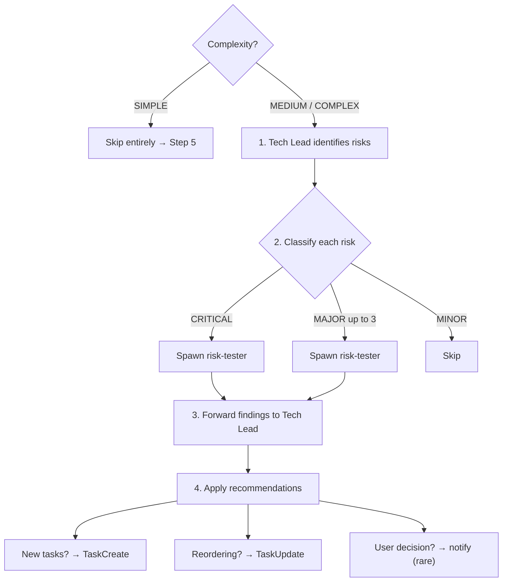

# Risk Analysis Protocol (MEDIUM and COMPLEX only)

> After Tech Lead validates the plan, run a pre-implementation risk analysis to catch problems BEFORE code is written.

## Decision tree



## 1. Tech Lead identifies risks

```
SendMessage to tech-lead:
"IDENTIFY RISKS: Review the validated task list and identify what could go wrong during implementation.

For each risk:
- What could break or go wrong?
- Which tasks are affected?
- Severity: CRITICAL (data loss, security hole, breaks production) / MAJOR (logic bugs, integration failures) / MINOR (edge cases, suboptimal patterns)
- What should a risk tester investigate in the codebase to verify this risk?

Format:
RISK-1: [description]
  Severity: CRITICAL
  Affected tasks: #1, #3
  Verify: [specific things to check — files to read, code paths to trace, constraints to validate]

RISK-2: [description]
  Severity: MAJOR
  Affected tasks: #2
  Verify: [what to check]

Focus on: data integrity, auth/security implications, breaking changes to existing features,
integration points between tasks, missing edge cases, performance implications, external API contracts.

Return at least 3 risks, prioritized by severity."
```

## 2. Spawn risk testers (one-shot, parallel — one per CRITICAL/MAJOR risk)

Risk testers use the dedicated `team:risk-tester` agent type (defined in `agents/risk-tester.md`).
Unlike reviewers, they can **write and run test scripts** for empirical verification.

```
Task(
  subagent_type="team:risk-tester",
  prompt="RISK: {risk description from Tech Lead}
SEVERITY: {severity}
AFFECTED TASKS: {task IDs and their descriptions}
WHAT TO VERIFY: {verification instructions from Tech Lead}
RELEVANT CODE: {file paths from researcher findings that relate to this risk}"
)
```

Spawn risk testers for all CRITICAL risks and up to 3 MAJOR risks. Skip MINOR risks.
Launch them **in parallel** — each investigates independently.

**Reference for risk testers:** If needed, Lead reads `@references/risk-testing-example.md` for the detailed case study pattern. Only load this reference when spawning risk testers — not at initialization.

## 3. Forward findings to Tech Lead for review and plan updates

```
SendMessage to tech-lead:
"RISK ANALYSIS RESULTS:

{paste all risk tester findings}

Based on these findings:
1. Update DECISIONS.md with confirmed risks and their mitigations
2. For CONFIRMED risks: add mitigation criteria to affected task descriptions (use TaskUpdate to append to description)
3. Mark tasks with CONFIRMED CRITICAL risks as high-risk (these get 3 reviewers during review)
4. If any risk requires task reordering or new tasks — recommend changes

Reply with summary of changes made."
```

## 4. Lead applies Tech Lead's recommendations

- If Tech Lead suggests new tasks → create them (TaskCreate)
- If Tech Lead suggests reordering → adjust dependencies (TaskUpdate)
- If a risk requires user decision (e.g., "accept data loss during migration or add backward compatibility?") → notify user

**Real-world example:** See `@references/risk-testing-example.md` for the detailed case study (includes comparison table of risk analysis vs review).
