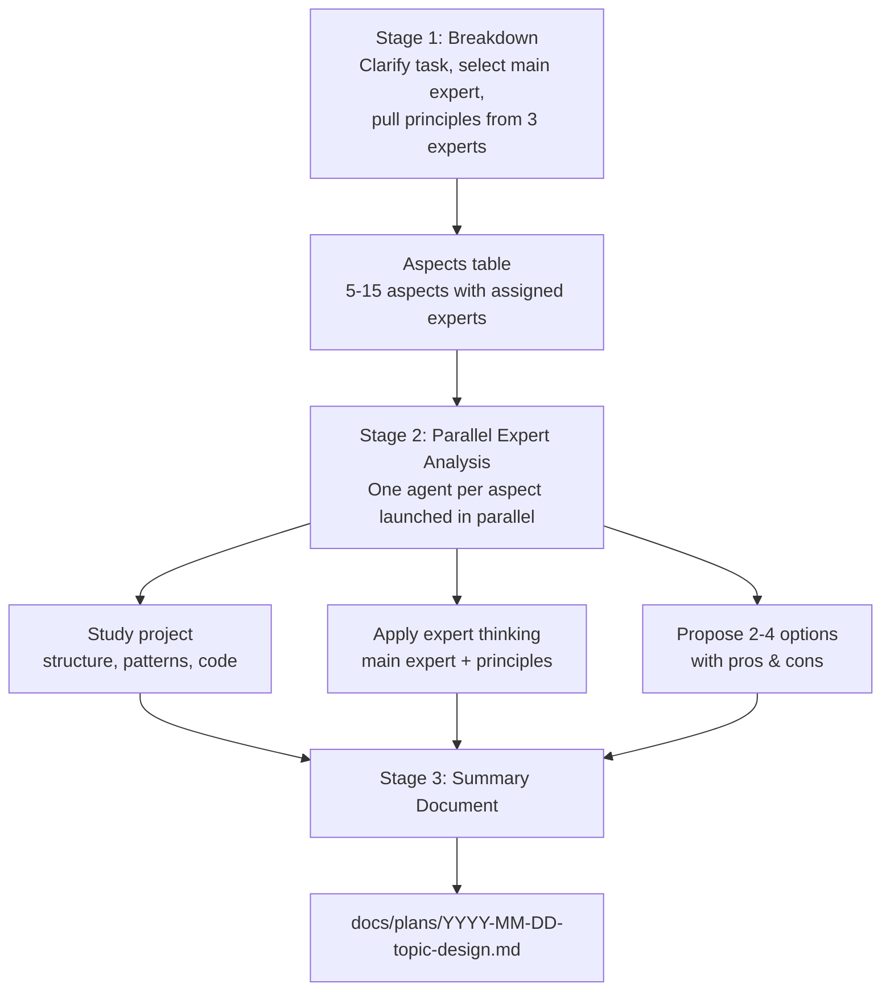

<p align="right"><strong>English</strong> | <a href="./README.ru.md">Русский</a></p>

# Think

Plan complex tasks before coding with structured expert analysis.

## Installation

```bash
/plugin marketplace add izzzzzi/izTeam
/plugin install think@izteam
```

## Usage

```
/think <task or idea>
```

**Example:**
```
/think Implement a feedback collection system with cashback rewards
```

## How It Works



The summary document includes: table of contents, overview with key decisions, details for each aspect with comparison tables, phased implementation plan, and success metrics.

## Structure

```
think/
├── .claude-plugin/
│   └── plugin.json
├── skills/
│   └── think/SKILL.md
├── agents/
│   └── expert.md
├── README.md
└── README.ru.md
```

## Result

A planning document that includes:
- Experts used per section
- Decision tables
- Code examples
- Phased implementation plan
- Success metrics

## When to Use

- New features with many non-obvious decisions
- Refactoring where multiple approaches are possible
- Architectural changes
- Any task that needs careful planning before coding

## License

MIT
